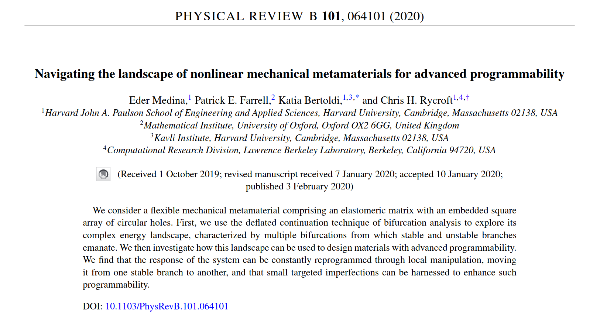

# Navigating the landscape of nonlinear mechanical metamaterials for advanced programmability

*Eder Medina*,
[Patrick E. Farrell](http://www.pefarrell.org/ ),
[Katia Bertoldi](https://bertoldi.seas.harvard.edu/), 
[Chris H. Rycroft](http://people.seas.harvard.edu/~chr/)


# Citation
```
@article{medina2020NMML,
title = {Navigating the landscape of nonlinear mechanical metamaterials for advanced programmability},
  author = {Medina, Eder and Farrell, Patrick E. and Bertoldi, Katia and Rycroft, Chris H.},
  journal = {Phys. Rev. B},
  volume = {101},
  issue = {6},
  pages = {064101},
  numpages = {6},
  year = {2020},
  month = {Feb},
  publisher = {American Physical Society},
  doi = {10.1103/PhysRevB.101.064101},
  url = {https://link.aps.org/doi/10.1103/PhysRevB.101.064101}
}
```

# Research Article Publisher version (Open Access): https://journals.aps.org/prb/abstract/10.1103/PhysRevB.101.064101
or, **Click on Image Below**
[](https://journals.aps.org/prb/abstract/10.1103/PhysRevB.101.064101)


# Dependecies 
NMML is dependent on two libaries:

* FEniCS--2019.1.0, available at https://fenicsproject.org/

* defcon -- latest version, available at https://bitbucket.org/pefarrell/defcon/src/master/
